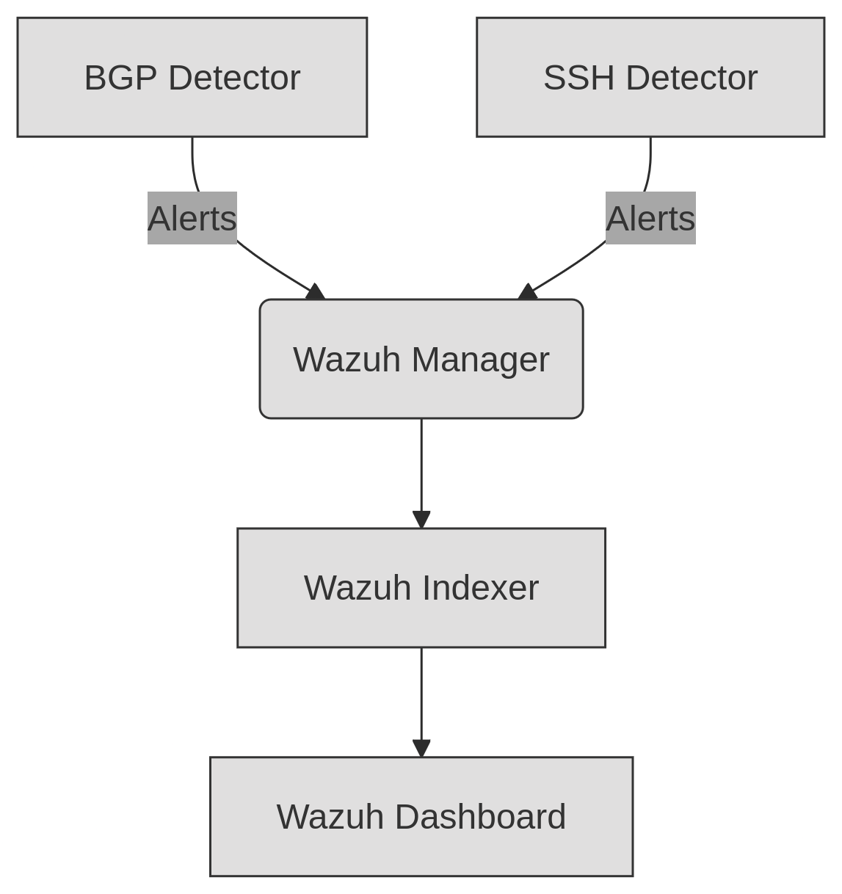

# Security Detectors for Wazuh


Modular security detectors integrating with Wazuh for:
- **BGP Hijack Detection** (Rule ID 900100)
- **SSH Bruteforce Protection** (Rule ID 900001)

## Table of Contents

- [Features](#features)
- [Quick Start (Development)](#quick-start-development)
- [Production Deployment](#production-deployment)
- [Architecture](#architecture)
- [Customization](#customization)
  - [Adding Detectors](#adding-detectors)
  - [Modifying Rules](#modifying-rules)
- [Troubleshooting](#troubleshooting)
- [License](#license)
- [Key Production Requirements](#key-production-requirements)
- [Performance Tuning](#performance-tuning)

## Features

| Detector       | Mock Data         | Production Source              | Alert Threshold          |
|----------------|-------------------|--------------------------------|--------------------------|
| BGP Hijack     | ✅ Fake ASN routes | BGPStream API                  | 1 anomalous announcement |
| SSH Bruteforce | ✅ Random IPs      | Wazuh alerts (rules 5710-5719) | 5 fails/10 min           |

## Quick start (Development)

```bash
# Run with mock data
docker-compose --profile mock up -d

# View logs
docker-compose logs -f bgp-detector ssh-detector
```

## Production deployment

1. Prerequisites

```bash
# Clone repository
git clone https://github.com/your-repo/security-wazuh-detectors
cd security-wazuh-detectors

# Create production .env file
cat > .env.prod <<EOF
WAZUH_API_USER=admin
WAZUH_API_PASS=YourSecurePassword!
INDEXER_PASSWORD=YourElasticPassword!
USE_MOCK=false
BGPSTREAM_API_KEY=your_real_api_key  # Required for BGP detector
EOF
```

2. Configuration
3. 
For BGP Detector:

```bash
# Enable production mode
echo "USE_MOCK=false" >> .env.prod

# Set real BGPStream API key
echo "BGPSTREAM_API_KEY=your_live_key" >> .env.prod
```

For SSH Detector:

```bash
# Adjust thresholds if needed
echo "FAILED_ATTEMPT_THRESHOLD=7" >> .env.prod
echo "TIME_WINDOW_MINUTES=15" >> .env.prod
```

3. Deployment

```bash
# Start all services in production mode
docker-compose --env-file .env.prod up -d --build

# Verify services
docker-compose ps
```

4. Verification

```bash
# Check Wazuh alerts
docker exec wazuh-manager tail -f /var/ossec/logs/alerts/alerts.json | grep -E '900100|900001'

# Expected production alert example:
# {
#   "rule": {"id": 900001, "level": 10},
#   "agent": {"ip": "203.0.113.45"},
#   "ssh": {"attempts": 7, "is_mock": false}
# }
```

## Architecture




## Customization

### Adding Detectors

1. Create new folder in detectors/
2. Implement:

```
# main logic
src/detector.cpp 

# mock generator
src/mock_*.hpp 
```

3. Add rule to `wazuh/config/local_rules.xml`

### Modifying rules

Edit wazuh/config/local_rules.xml:

```xml
<rule id="900001" level="10">
  <description>SSH Bruteforce (Customized)</description>
  <field name="ssh.attempts">^7$</field>  <!-- Match exact count -->
</rule>
```

## Troubleshooting

* Alerts not appearing -> Verify Wazuh API connectivity: curl -ku admin:password https://localhost:55000
* High CPU usage -> Increase `CHECK_INTERVAL` in detector's Dockerfile
* Mock data in production -> Ensure .env has `USE_MOCK=false`

## License

Apache 2.0

## Key Production Requirements

1. **For BGP Detector**:
   - Valid [BGPStream API key](https://bgpstream.caida.org/docs/api)
   - Internet access to BGPStream servers
   - Minimum 2GB RAM allocated to Docker

2. **For SSH Detector**:
   - Wazuh agents configured to monitor SSH logs
   - `/var/ossec/logs/alerts` volume mounted
   - Rule IDs 5710-5719 enabled in Wazuh

3. **Security**:
   ```bash
   # Rotate credentials after deployment
   docker-compose exec wazuh-manager /var/ossec/bin/wazuh-control stop
   # Edit /var/ossec/etc/api.yaml
   docker-compose exec wazuh-manager /var/ossec/bin/wazuh-control start
   ```
   
## Performance tuning

```yaml
# In docker-compose.yml
deploy:
  resources:
    limits:
      cpus: '1'
      memory: 512M
```
